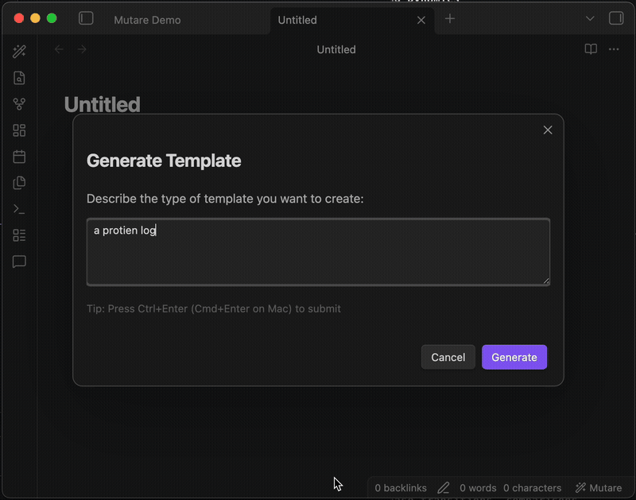

# Mutare

**Autonomous LLM-powered note editing for Obsidian.**

*Mutare* (Latin: "to change") lets you describe what you want changed in your note, and an AI makes it happen. No more manual find-and-replace or tedious reformatting—just tell the AI what to do.

<p align="center">
  
</p>

<p align="center">
  
</p>

## Features

- **Multiple access points** — Use whichever fits your workflow:
  - 🎨 **Ribbon icon** — Click the wand in the left sidebar
  - ⌨️ **Command palette** — `Cmd+P` → "Mutare"
  - 📝 **Slash commands** — Type `/mutare` in any note
  - 🖱️ **Context menu** — Right-click in the editor
  - 📊 **Status bar** — Click "Mutare" in the bottom-right

- **Smart editing commands**:
  - `Edit note` — Opens a prompt for custom instructions
  - `Edit with selection` — Uses selected text as the instruction
  - `Auto-improve` — Automatically fixes typos, grammar, and clarity
  - `Generate template` — Create Obsidian templates from a description
  - `Quick prompts` — Fuzzy-searchable preset prompts

- **Multi-provider support**:
  - Anthropic Claude (claude-sonnet-4-5, claude-haiku-4-5, claude-opus-4-5)
  - OpenAI (gpt-5.2, gpt-5.1, gpt-5.1-mini, gpt-4.1, gpt-4.1-mini)
  - Google Gemini (gemini-3-pro, gemini-3-flash, gemini-2.5-pro, gemini-2.5-flash)

- **Preview before applying** — See exactly what will change, with `Cmd+Enter` to quickly accept

- **AI reasoning** — Understand *why* the AI made each change

- **Edit history** — View past edits and revert if needed

- **Custom prompts** — Create, edit, and manage your own quick prompts

- **Reliable** — Automatic retry with exponential backoff for network issues

## How It Works

1. Open any note in Obsidian
2. Access Mutare via any method (ribbon, command palette, `/mutare`, context menu, or status bar)
3. Describe what you want: *"Fix typos"*, *"Convert to bullet points"*, *"Add a summary"*
4. Review the proposed changes in a preview modal
5. Press `Cmd+Enter` or click **Apply Edits** to make the changes

Under the hood, Mutare:
- Sends your note content with line numbers to an LLM
- Receives structured edit instructions (which lines to replace, insert, or delete)
- Applies edits precisely using Obsidian's Editor API

## Installation

### From Obsidian Community Plugins

1. Open Settings → Community plugins
2. Search for "Mutare"
3. Install and enable

### Manual Installation

1. Download `main.js`, `manifest.json`, and `styles.css` from the [latest release](https://github.com/kaneda2004/Mutare-for-Obsidian/releases)
2. Create a folder: `YOUR_VAULT/.obsidian/plugins/mutare/`
3. Copy the three files into that folder
4. Enable the plugin in Obsidian settings

## Configuration

Go to **Settings → Mutare** to configure:

| Setting | Description |
|---------|-------------|
| **AI Provider** | Choose Anthropic, OpenAI, or Gemini |
| **API Keys** | Enter your API key for each provider |
| **Model** | Select which model to use per provider |
| **Confirm before applying** | Show preview modal (recommended) |
| **Show AI reasoning** | Display the AI's explanation for changes |
| **Custom system prompt** | Add your own instructions to the AI |
| **Quick Prompts** | Add, edit, or delete custom prompts |

## Usage Examples

### Fix Writing Issues
> "Fix any typos, grammar issues, and improve clarity"

### Restructure Content
> "Convert this to a bulleted list with headers"

### Add Content
> "Add a TL;DR summary at the top"

### Task Management
> "Mark all completed items with [x] and move them to the bottom"

### Formatting
> "Format this as a table with columns for Name, Date, and Status"

## Quick Access Methods

| Method | How to Use |
|--------|------------|
| **Ribbon** | Click the wand icon (🪄) in the left sidebar |
| **Command Palette** | `Cmd+P` / `Ctrl+P` → type "Mutare" |
| **Slash Command** | Type `/mutare` in any note, then select an action |
| **Context Menu** | Right-click in the editor → Mutare options |
| **Status Bar** | Click "Mutare" in the bottom-right corner |
| **Hotkeys** | Settings → Hotkeys → search "Mutare" to assign custom shortcuts |

## How Edits Work

Mutare uses a structured approach to ensure reliable edits:

```
Note with line numbers:        LLM returns:
   0 | # My Note               { "edits": [
   1 |                           {"line": 2, "action": "replace",
   2 | - [ ] Task one              "content": "- [x] Task one"},
   3 | - [x] Task two            {"line": 4, "action": "insert",
   4 |                              "content": "## Completed"}
                               ]}
```

Edits are applied **bottom-up** (highest line number first) to preserve line number accuracy.

## Requirements

- Obsidian v1.4.0 or higher
- An API key from at least one supported provider:
  - [Anthropic Console](https://console.anthropic.com/)
  - [OpenAI Platform](https://platform.openai.com/)
  - [Google AI Studio](https://aistudio.google.com/)

## Privacy & Security

- Your notes are sent to the AI provider you select
- API keys are stored locally in your vault's plugin data
- No data is collected or sent anywhere except to your chosen AI provider
- Consider using a local LLM provider if privacy is critical (future feature)

## Development

```bash
# Clone the repo
git clone https://github.com/kaneda2004/Mutare-for-Obsidian.git
cd Mutare-for-Obsidian

# Install dependencies
npm install

# Build for development (with watch mode)
npm run dev

# Build for production
npm run build
```

### Project Structure

```
mutare/
├── src/
│   ├── main.ts              # Plugin entry point
│   ├── types.ts             # TypeScript types & Zod schemas
│   ├── settings.ts          # Settings tab
│   ├── providers/           # LLM provider implementations
│   │   ├── base.ts          # Abstract provider class + retry logic
│   │   ├── anthropic.ts     # Anthropic Claude
│   │   ├── openai.ts        # OpenAI GPT
│   │   └── gemini.ts        # Google Gemini
│   ├── editor/              # Editor utilities
│   │   ├── formatter.ts     # Line number formatting
│   │   └── applier.ts       # Edit application logic
│   ├── prompts/             # System prompts
│   └── ui/                  # Modal components
│       ├── preview-modal.ts # Edit preview with diff
│       ├── instruction-modal.ts
│       ├── quick-prompt-modal.ts
│       ├── history-modal.ts # Edit history viewer
│       └── slash-suggest.ts # /mutare slash commands
├── manifest.json            # Obsidian plugin manifest
├── styles.css               # Plugin styles
└── esbuild.config.mjs       # Build configuration
```

## Contributing

Contributions are welcome! Please:

1. Fork the repository
2. Create a feature branch (`git checkout -b feature/amazing-feature`)
3. Commit your changes (`git commit -m 'Add amazing feature'`)
4. Push to the branch (`git push origin feature/amazing-feature`)
5. Open a Pull Request

## License

MIT License — see [LICENSE](LICENSE) for details.

## Acknowledgments

- Built with the [Obsidian Plugin API](https://docs.obsidian.md/)
- Uses [Zod](https://zod.dev/) for schema validation
- Inspired by modern AI coding assistants

---

**Mutare** — *Let AI transform your notes.*
