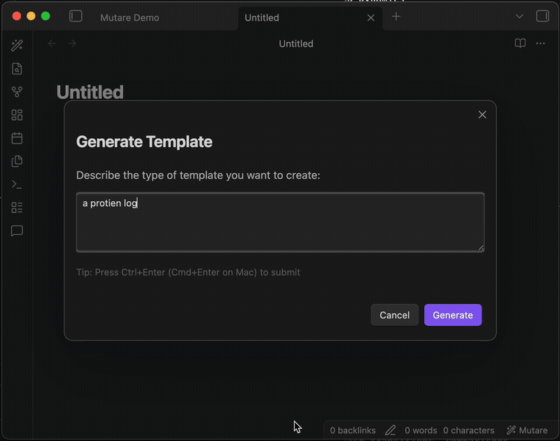

# Mutare

LLM-assisted note editing for Obsidian.

Mutare lets you describe a change you want in a note, preview the proposed edits, and apply them directly inside the editor.

<p align="center">
  
</p>

<p align="center">
  
</p>

## What it does

Mutare adds AI-powered editing actions to Obsidian. Instead of manually restructuring or cleaning up a note, you can give an instruction such as:

- "Fix typos and tighten the wording"
- "Convert this section into bullet points"
- "Add a short summary at the top"
- "Turn this into a reusable template"

The plugin sends the note content to the selected model provider, receives structured edit instructions, and applies those changes through Obsidian's editor API.

## Features

- Multiple entry points:
  - ribbon icon
  - command palette
  - slash command
  - editor context menu
  - status bar action
- Preview before apply
- Edit history with revert support
- Quick prompts for repeated actions
- Multi-provider support:
  - Anthropic
  - OpenAI
  - Gemini
- Retry handling for transient provider failures

## How it works

1. Open a note in Obsidian
2. Launch Mutare from the ribbon, command palette, slash command, context menu, or status bar
3. Enter an editing instruction
4. Review the proposed changes
5. Apply the edits to the note

Under the hood, Mutare:

- formats note content with line references,
- asks the model for structured edit operations,
- applies inserts, replacements, and deletions deterministically.

Edits are applied bottom-up so line references remain stable while changes are being written.

## Installation

### Community Plugins

1. Open `Settings -> Community plugins`
2. Search for `Mutare`
3. Install and enable the plugin

### Manual installation

1. Download `main.js`, `manifest.json`, and `styles.css` from the [latest release](https://github.com/kaneda2004/Mutare-for-Obsidian/releases)
2. Create `YOUR_VAULT/.obsidian/plugins/mutare/`
3. Copy the files into that folder
4. Enable the plugin in Obsidian settings

## Configuration

Mutare settings let you configure:

- provider selection,
- provider API keys,
- model choice,
- preview-before-apply behavior,
- reasoning visibility,
- system prompt customization,
- quick prompt definitions.

## Supported providers

- Anthropic Claude
- OpenAI GPT models
- Google Gemini

Available model options depend on the current plugin release and provider support.

## Development

```bash
git clone https://github.com/kaneda2004/Mutare-for-Obsidian.git
cd Mutare-for-Obsidian
npm install
npm run dev
```

Production build:

```bash
npm run build
```

## Project structure

```text
src/
  main.ts
  settings.ts
  types.ts
  providers/
  editor/
  prompts/
  ui/
manifest.json
styles.css
esbuild.config.mjs
```

## Requirements

- Obsidian `v1.4.0+`
- API key for at least one supported provider

## Privacy

- Notes are sent to the provider you select
- API keys are stored locally in plugin data
- The plugin does not depend on a separate hosted backend

## License

MIT License
